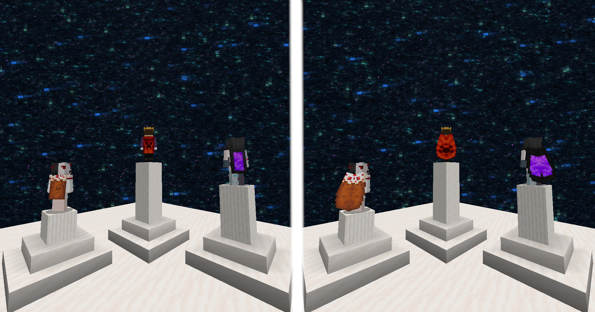
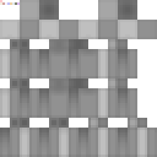

# More Capes

---

With this mod, you can use any cape you want and everyone who has this mod installed will also see it.  

## Change your cape

There are two ways to change your cape. Both are done by running a command directly in-game.  

After changing your cape:
- if you are playing singleplayer, you must restart your game
- if you are playing multiplayer, simply reconnect to the server and the cape will be updated for all players

### 1. From URL

This is the easiest way to change your cape. Simply use the `/cape set url [url]` command in-game.
Please note that the URL **must** point to a texture hosted on Mojang's official servers

You can find a list of some URLs [here](CAPES_URL.md).

### 2. From file

Open your `config` directory. Inside, you should see a directory named `more-capes` (otherwise, create it).  
You can now put `.png` files to be used as capes in this directory.

With the command `/cape set file [path]` you can now upload any PNG file to be used as your cape.  
If you don't see any capes while typing the command, you should use the `/cape reload` command.

Once your cape is applied, its URL is provided. Feel free to join my [Discord](https://discord.gg/ZeHm57BEyt) and share your capes in the [#more-capes-gallery](https://discord.com/channels/1143518666428780575/1457127193141317839) channel!

### 3. Reset your cape

You can remove your cape by running the `/cape reset` command.

## How does it work?

All capes are uploaded to Mojang servers. This allows us to have a URL in this format `http://textures.minecraft.net/texture/[hash]` where `[hash]` represents a 64-character-long hexadecimal string.  
This 64-character-long string can be stored as 8 pixels using the _#AARRGGBB_ format.  
These pixels are stored in the top-left corner of the player skin.

As you can see on this image, an additional pixel is placed exactly on (0,0). It allows the mod to know which players have a cape embedded in their skin.  
